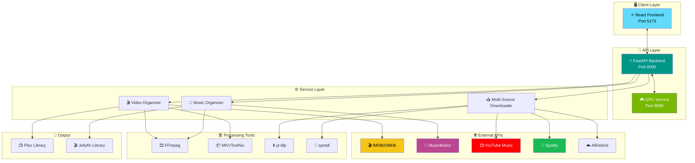
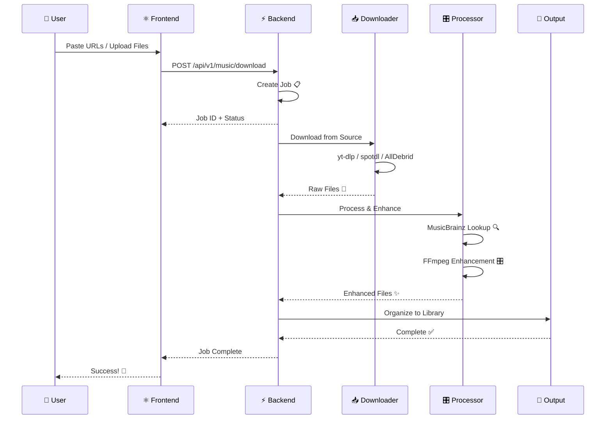

<div align="center">


# ⭐ Stellar Media Organizer

### *Your Media, Perfectly Organized* ✨

[](https://python.org)
[](https://reactjs.org)
[](https://fastapi.tiangolo.com)
[](https://typescriptlang.org)
[](LICENSE)

**Organize movies, TV series & music for Plex/Jellyfin with IMDB/MusicBrainz integration, GPU video conversion, and professional audio enhancement.**

[🚀 Quick Start](#-quick-start) • [✨ Features](#-features) • [🏗️ Architecture](#️-architecture) • [📦 Tech Stack](#-tech-stack) • [📖 Documentation](#-documentation)

</div>

---

## 🎯 What is Stellar?

Stellar Media Organizer is an all-in-one solution for managing your media library. Whether you're downloading movies, TV series, or music - Stellar automatically organizes, enhances, and prepares everything for your media server.

```
🎬 Messy Downloads  →  ⭐ Stellar  →  📺 Perfect Plex Library
```

---

## ✨ Features

<table>
<tr>
<td width="50%">

### 🎬 Video Organization
- 🔍 **IMDB Integration** - Auto-lookup for accurate naming
- 🎯 **Smart Detection** - Movies, TV series, anime
- 🔊 **Audio Filtering** - Keep only your languages
- ⚡ **GPU Conversion** - Hardware-accelerated HEVC
- 📁 **Plex/Jellyfin Ready** - Perfect folder structure

</td>
<td width="50%">

### 🎵 Music Organization
- 🎼 **MusicBrainz Lookup** - Artist, album, track metadata
- 📥 **Multi-Source Download** - YouTube, Spotify, AllDebrid
- 🎛️ **Audio Enhancement** - Professional FFmpeg presets
- 📊 **EBU R128** - Broadcast-standard loudness
- 🎧 **Format Options** - FLAC, MP3, M4A, Opus

</td>
</tr>
</table>

### 🎛️ Audio Enhancement Presets

| Preset | Description | Best For |
|--------|-------------|----------|
| ✨ **Optimal** | Rich, loud, professional | Most music |
| 🎯 **Clarity** | Crystal clear vocals | Podcasts, acoustic |
| 🔊 **Bass Boost** | Deep, punchy bass | EDM, hip-hop |
| 🌅 **Warm** | Vintage analog warmth | Jazz, classical |
| ☀️ **Bright** | Crisp, sparkling highs | Pop, rock |
| 📊 **Flat** | Just loudness normalization | Purists |

---

## 🏗️ Architecture



### 📊 Data Flow



---

## 🚀 Quick Start

### Prerequisites

```bash
# macOS
brew install python node ffmpeg mkvtoolnix

# Ubuntu/Debian
sudo apt install python3 nodejs npm ffmpeg mkvtoolnix
```

### Installation

```bash
# 1️⃣ Clone the repo
git clone https://github.com/yourusername/stellar-media-organizer.git
cd stellar-media-organizer

# 2️⃣ Configure environment
cp config.env.example config.env
# Edit config.env with your API keys and paths

# 3️⃣ Start all services
./start.sh
```

### 🌐 Open in Browser

```
http://localhost:5173
```

---

## ⚙️ Configuration

Edit `config.env`:

```bash
# 📂 Output Directories
MEDIA_PATH=/path/to/processed/videos
MUSIC_OUTPUT_PATH=/path/to/music

# 🔑 API Keys
ALLDEBRID_API_KEY=your_key_here

# 🎵 MusicBrainz (optional - higher rate limits)
MUSICBRAINZ_CLIENT_ID=
MUSICBRAINZ_CLIENT_SECRET=
```

---

## 📦 Tech Stack

<table>
<tr>
<td align="center" width="20%">

### ⚡ Backend


</td>
<td align="center" width="20%">

### ⚛️ Frontend


</td>
<td align="center" width="20%">

### 🎨 Styling


</td>
<td align="center" width="20%">

### 🛠️ Tools


</td>
<td align="center" width="20%">

### 📡 APIs


</td>
</tr>
</table>

### Full Stack Details

| Layer | Technology | Version |
|-------|------------|---------|
| 🐍 Runtime | Python | 3.10+ |
| ⚡ API Framework | FastAPI | 0.115+ |
| 🔄 ASGI Server | Uvicorn | Latest |
| ✅ Validation | Pydantic | 2.x |
| ⚛️ UI Framework | React | 18 |
| 📦 Build Tool | Vite | 6 |
| 🎨 CSS Framework | TailwindCSS | 3.x |
| 🧩 UI Components | DaisyUI | 5.x |
| 🎞️ Video Processing | FFmpeg | Latest |
| 📦 MKV Tools | MKVToolNix | Latest |
| ⬇️ YouTube | yt-dlp | Latest |
| 🎵 Spotify | spotdl | Latest |
| 🐳 Containers | Docker | Latest |

---

## 🖥️ Services

| Service | Port | Description |
|---------|------|-------------|
| ⚛️ Frontend | `5173` | React web UI |
| ⚡ Backend | `8000` | FastAPI server |
| 🎮 GPU | `8888` | Video conversion |

---

## 💻 CLI Usage

```bash
# 🎬 Organize video files
python media_organizer.py organize /path/to/media

# 🔊 Filter audio tracks
python media_organizer.py filter /path/to/media --language malayalam

# 🎵 Organize music with enhancement
python music_organizer.py /path/to/music \
  --output /path/to/output \
  --preset optimal \
  --format flac
```

---

## 📖 Documentation

- [🏗️ Project Structure](.kiro/steering/structure.md)
- [🛠️ Tech Stack Details](.kiro/steering/tech.md)
- [📋 Product Features](.kiro/steering/product.md)

---

## 📝 Changelog

### v2.0.0 - *Stellar Release* ⭐ (December 2024)

#### 🎵 Music Features
- ✨ Multi-source download (YouTube Music, Spotify, AllDebrid)
- 🎛️ Professional audio enhancement with 6 presets
- 🎼 MusicBrainz metadata integration
- 📊 EBU R128 loudness normalization
- 🎧 Format conversion (FLAC, MP3, M4A, Opus)

#### 🎬 Video Features  
- 🔍 IMDB integration for accurate naming
- ⚡ GPU-accelerated video conversion
- 🔊 Audio track filtering by language
- 📁 Plex/Jellyfin compatible structure

#### 🖥️ UI/UX
- 🌌 Space-themed glassmorphism design
- 📊 Real-time job tracking dashboard
- 🎯 Activity monitoring with live logs
- 📱 Responsive mobile-friendly layout

#### 🔧 Technical
- ⚡ FastAPI backend with async support
- ⚛️ React 18 with TypeScript
- 🎨 TailwindCSS + DaisyUI styling
- 🐳 Docker support for deployment

---

## 🤝 Contributing

Contributions are welcome! Please feel free to submit a Pull Request.

---

## 📄 License

This project is licensed under the MIT License - see the [LICENSE](LICENSE) file for details.

---

<div align="center">

**Made with ❤️ for media enthusiasts**

⭐ Star this repo if you find it useful!

</div>
